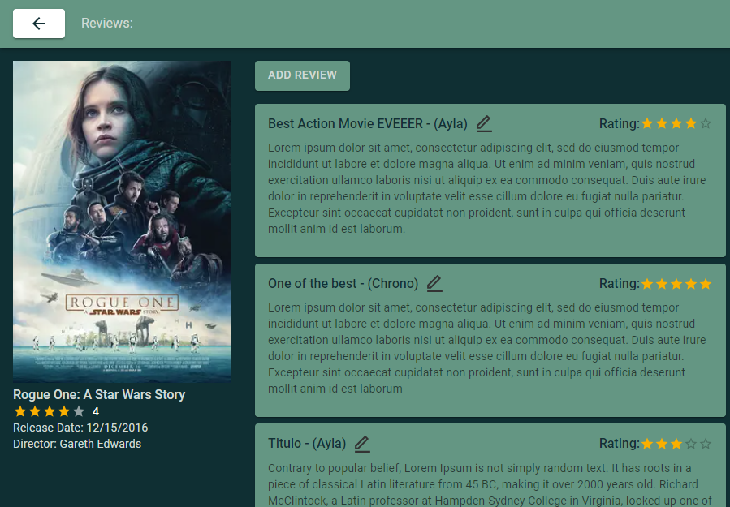

<h1 align="center">
    EcoPortal Coolmovies Test
</h1>




## Technologies

This project was developed with the following technologies:

- [NextJS](https://nextjs.org)
- [Typescript](https://www.typescriptlang.org)
- [Material-UI](https://mui.com/pt/)
- [Redux](https://redux.js.org)
- [Redux Observable](https://redux-observable.js.org)
- [RsJS](https://rxjs.dev)
- [Apollo](https://www.apollographql.com)

---

## What can be done next?

- Add user authentication, right now users can edit any review.
- Better error handling

## Setup

- Required ENV Variables:

  ```sh
  API_URL='http://localhost:5001/graphql'
  ```

- Running the project:

  ```sh
  cd coolmovies-backend
  docker-compose up -d
  cd ../coolmovies-frontend
  npm run dev
  ```

## License

This project is under the MIT license. See the [LICENSE](https://github.com/alexandreh92/react-code-exercise/blob/master/LICENSE) for more information.

---

Thank you for this amazing opportunity! It was a pleasure to work on this project

made with ♥&nbsp;by vdiorio

[Get in touch!](https://www.linkedin.com/in/vitordiorio/)
